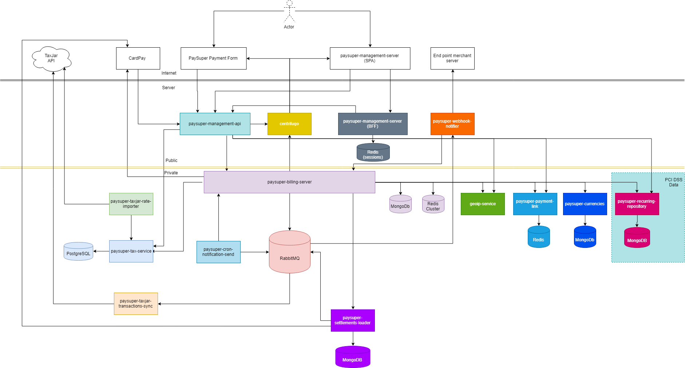

# PaySuper Billing Server

[](https://www.gnu.org/licenses/gpl-3.0) 
[](https://github.com/paysuper/paysuper-/issues)
[](https://travis-ci.org/paysuper/paysuper-billing-server) 
[](https://codecov.io/gh/paysuper/paysuper-billing-server) 
[](https://goreportcard.com/report/github.com/paysuper/paysuper-billing-server)

PaySuper is a unique, simple payment toolkit designed to make developers self-reliant. It’s an open-source payment service with a highly customizable payment form, an intuitive API, and comprehensible, eye-catching reports.

Billing Server is a core and heart of all PaySuper for a payment processing business logic. It is designed to be mediator micro-service for [Management API](https://github.com/paysuper/paysuper-management-api) covering all REST API for based interfaces for [Dashboard](https://github.com/paysuper/paysuper-management-server) and [Payment Form](https://github.com/paysuper/paysuper-payment-form). PaySuper Management API is documented in the [API Reference](https://docs.pay.super.com/api).

Learn more about a [payments flow](https://docs.pay.super.com/docs/payments/quick-start) and [PaySuper Checkout integration](https://docs.pay.super.com/docs/payments/quick-start/#step-4-set-up-a-checkout-form).

|   | PaySuper Service Architecture
:---: | :---
✨ | **Checkout integration.** [PaySuper JS SDK](https://github.com/paysuper/paysuper-js-sdk) is designed to integrate a Checkout Form on a merchant's website or a game client.
💵 | **Frontend for a payment form.** [PaySuper Payment Form](https://github.com/paysuper/paysuper-payment-form) is a frontend for a single-page application with a payment form.
📊 | **Frontend for a merchant.** [PaySuper Dashboard](https://github.com/paysuper/paysuper-dashboard) is the BFF server and frontend to interact with all PaySuper related features for merchants.
🔧 | **Payment Form API Backend.** [PaySuper Checkout](https://github.com/paysuper/paysuper-checkout) is a REST API backend for [PaySuper Payment Form](https://github.com/paysuper/paysuper-payment-form) and a billing processing such as purchase receipts and others. Public API methods are documented in the [API Reference](https://docs.pay.super.com/api).
🔧 | **Billing API Backend.** [PaySuper Management API](https://github.com/paysuper/paysuper-management-api) is a REST API backend for [PaySuper Dashboard](https://github.com/paysuper/paysuper-dashboard) and other management API methods. Public API methods are documented in the [API Reference](https://docs.pay.super.com/api).
💳 | **Payment processing.** [PaySuper Billing Server](https://github.com/paysuper/paysuper-billing-server) is a micro-service that provides with any payment processing business logic.

***

## Features

* Support for the payment tokens for the order and user data.

* PaySuper can securely store your customer’s billing address and the payment method data to prefill the Checkout Form with. The customer has to agree for this to happen.

* VAT/Sales tax have a clear and automatic calculation.

* Payment Link feature.

* Detailed statistics for each transaction.

* Transparent payout calculation.

* Recurring invoices (work is in progress).

## Table of Contents

- [Getting Started](#getting-started)
    - [Architecture](#architecture)
- [Developing](#developing)
    - [Branches](#branches)
    - [Docker deployment](#docker-deployment)
    - [Starting the application](#starting-the-application)
- [Contributing](#contributing-support-feature-requests)
- [License](#license)

## Getting Started

Billing Server is designed to be cloud agnostic application. In general we use Kubernetes based installation to launch PaySuper in a dev environment cloud and AWS for production.

### Architecture



## Developing

### Branches

We use the [GitFlow](https://nvie.com/posts/a-successful-git-branching-model) as a branching model for Git.

### Docker deployment

```bash
docker build -f Dockerfile -t paysuper_billing_service

docker run -d -e "MONGO_DSN=mongodb://127.0.0.1:27017/billing_repository" -e "CACHE_PROJECT_PAYMENT_METHOD_TIMEOUT=600" paysuper_billing_service
```

### Starting the application

Billing Server application can be started in 2 modes:

* as microservice, to maintain rates requests from other components of system. This mode does not requests any rates
* as console app, to run the tasks, that passed as command line argument

Console mode can be used with cron schedule.

To start app in console mode you must set `-task` flag in command line to one of these values:

- `vat_reports` - to update vat reports data. This task must be run every day, at the end of day.
- `royalty_reports` - to build royalty reports for merchants. This task must be run once on a week.
- `royalty_reports_accept` - to auto-accept toyalty reports. This task must be run daily.

Notice: for `vat-reports` task you may pass an report date (from past only!) for that you need get an report. 
Date passed as `date` parameter, in YYYY-MM-DD format 

Example: `$ paysuper-billing-server.exe -task=vat_reports -date="2018-12-31"` runs VAT reports calculation for 
last day of December, 2018.

To run application as microservice simply don't pass any flags to command line :)  

### Environment variables

|Name|Description|
|:---|:---|
| MONGO_DSN                                           | MongoDB DSN connection string                                                                                                       |
| MONGO_DIAL_TIMEOUT                                  | MongoDB dial timeout in seconds                                                                                                     |
| PSP_ACCOUNTING_CURRENCY                             | PaySuper accounting currency                                                                                                        |
| METRICS_PORT                                        | HTTP server port for a health and metrics request                                                                                     |
| CENTRIFUGO_SECRET                                   | Centrifugo secret key                                                                                                               |
| CENTRIFUGO_API_SECRET                               | Centrifugo API secret key                                                                                                           |
| BROKER_ADDRESS                                      | RabbitMQ URL address                                                                                                                |
| CARD_PAY_API_URL                                    | CardPay API URL to process payments, more in [documentation](https://integration.cardpay.com/v3/)                                   | 
| CACHE_REDIS_ADDRESS                                 | A seed list of host:port addresses of cluster nodes                                                                                 |
| CACHE_REDIS_PASSWORD                                | Password for a connection string                                                                                                      |
| CACHE_REDIS_POOL_SIZE                               | PoolSize applies per cluster node and not for the whole cluster                                                                     |
| CACHE_REDIS_MAX_RETRIES                             | Maximum retries for connection                                                                                                      |
| CACHE_REDIS_MAX_REDIRECTS                           | The maximum number of retries before giving up                                                                                      |
| CACHE_REDIS_VERSION                                 | Version of cache (if you need to flush all cache)                                                                                   |
| CUSTOMER_COOKIE_PUBLIC_KEY                          | Base64 encoded RSA public key - used for encrypting customer browser cookies content. Minimal length of RSA public key must be 4096    |
| CUSTOMER_COOKIE_PRIVATE_KEY                         | Base64 encoded RSA private key - used for decrypting customer browser cookies content. Minimal length of RSA private key must be 4096  |
| REDIS_HOST                                          | Redis server host                                                                                                                   |
| REDIS_PASSWORD                                      | Password to access to Redis server                                                                                                  |
| CENTRIFUGO_MERCHANT_CHANNEL                         | Centrifugo channel name to send notifications to merchant                                                                           |
| CENTRIFUGO_FINANCIER_CHANNEL                        | Centrifugo channel name to send notifications to financier                                                                          |
| EMAIL_NOTIFICATION_FINANCIER_RECIPIENT              |Email of financier, to get VAT reports notification                                                                                  |
| EMAIL_CONFIRM_URL                                   | URL to use in a template of the confirmation email                                                                                        |
| EMAIL_CONFIRM_TEMPLATE                              | Confirmation email template name                                                                                                    |
| EMAIL_NEW_ROYALTY_REPORT_TEMPLATE                   | New royalty report notification email template name                                                                                 |
| EMAIL_UPDATE_ROYALTY_REPORT_TEMPLATE                | Royalty report update notification email template name                                                                              |
| EMAIL_VAT_REPORT_TEMPLATE                           | New VAT report notification email template name                                                                                     |
| EMAIL_NEW_PAYOUT_TEMPLATE                           | New payout notification email template name                                                                                         |
| HELLO_SIGN_DEFAULT_TEMPLATE                         | License agreement template identifier in HelloSign                                                                                  |
| HELLO_SIGN_AGREEMENT_CLIENT_ID                      | Client application identifier in HelloSign for a Merchant Agreement sign                                                              |
| KEY_DAEMON_RESTART_INTERVAL                         | Starting frequency in seconds of the script to check the locked keys and return them to the stack                                  |
| EMAIL_ACTIVATION_CODE_TEMPLATE                      | Postmark Email template ID for sending to user with an activation code                                                                 |
| PAYLINK_MIN_PRODUCTS                                | Minimum number of products allowed for one payment link (must be >= 1)                                                              |
| PAYLINK_MAX_PRODUCTS                                | Maximum number of products allowed for one payment link                                                                             |
| EMAIL_MERCHANT_NEW_ONBOARDING_REQUEST_TEMPLATE      | New onboarding request letter to a merchant template                                                                                  |
| EMAIL_ADMIN_NEW_ONBOARDING_REQUEST_TEMPLATE         | New onboarding request letter to an admin template                                                                                     |
| EMAIL_MERCHANT_ONBOARDING_REQUEST_COMPLETE_TEMPLATE | Onboarding request completed letter to a merchant template                                                                            |
| EMAIL_ONBOARDING_ADMIN_RECIPIENT                    | Email of onboarding administrator                                                                                                   |
| MIGRATIONS_LOCK_TIMEOUT                             | Timeout for processing DB migrations on the app start                                                                                      |
| USER_INVITE_TOKEN_SECRET                            | Secret key for generation invitation token of user                                                                                  |
| USER_INVITE_TOKEN_TIMEOUT                           | Timeout in hours for lifetime of invitation token of user                                                                           |
| DASHBOARD_URL                                       | URL of dashboard for generating links in notifications                                                                              |


## Contributing, Support, Feature Requests
If you like this project then you can put a ⭐️ on it. It means a lot to us.

If you have an idea of how to improve PaySuper (or any of the product parts) or have general feedback, you're welcome to submit a [feature request](../../issues/new?assignees=&labels=&template=feature_request.md&title=).

Chances are, you like what we have already but you may require a custom integration, a special license or something else big and specific to your needs. We're generally open to such conversations.

If you have a question and can't find the answer yourself, you can [raise an issue](../../issues/new?assignees=&labels=&template=support-request.md&title=I+have+a+question+about+%3Cthis+and+that%3E+%5BSupport%5D) and describe what exactly you're trying to do. We'll do our best to reply in a meaningful time.

We feel that a welcoming community is important and we ask that you follow PaySuper's [Open Source Code of Conduct](https://github.com/paysuper/code-of-conduct/blob/master/README.md) in all interactions with the community.

PaySuper welcomes contributions from anyone and everyone. Please refer to [our contribution guide to learn more](CONTRIBUTING.md).

## License

The project is available as open source under the terms of the [GPL v3 License](https://www.gnu.org/licenses/gpl-3.0).
